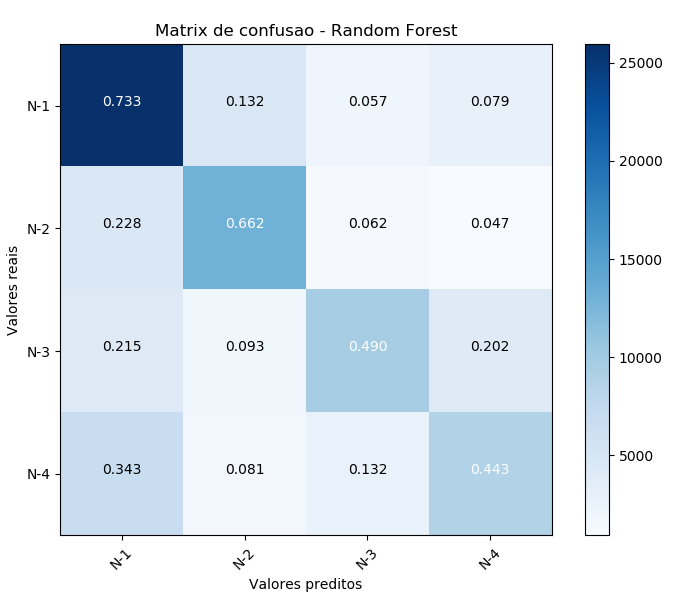

# Machine learning techniques to classify Parkinson's disease in the first four levels of the H-Y scale.

## Performance Metrics: 

Sensitivity 56.20%  
Specificity 85.35%  
Precision 56.14%  
Accuray 78.04%  

