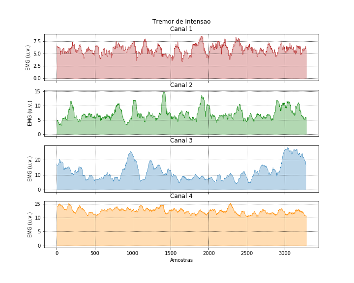

# Machine learning techniques to classify Parkinson's disease in the first four levels of the H-Y scale.

###Random Forest - Confusion Matrix:

###Random Forest - ROC Curve:

## Performance Metrics: 

Sensitivity 60.19%  
Specificity 86.86%  
Precision 60.24%  
Accuray 80.12%  

# Classification of a level 3 sample:

## Probability of levels:

