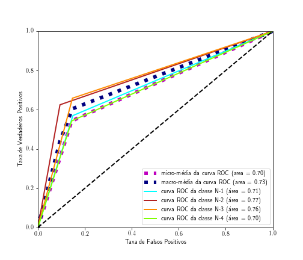

# Machine learning techniques to classify Parkinson's disease in the first four levels of the H-Y scale.

## Performance Metrics: 

Sensitivity 59.92%  
Specificity 86.58%  
Precision 58.19%  
Accuray 80.35%  

